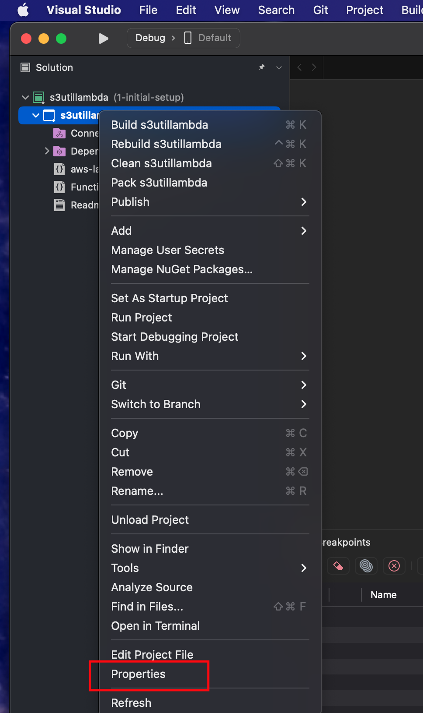

# AWS Lambda Testing on LocalStack
This example covers creating a C# dotnet Lambda, testing it in the Visual Studio debugger, and testing it on
LocalStack with hot-reloading.

## Deploying the App

To deploy your infrastructure, follow the steps below.

### Prerequisites

1. [Install Watchman](https://facebook.github.io/watchman/)
2. [Install LATEST AWS CLI](https://docs.aws.amazon.com/cli/latest/userguide/getting-started-install.html)

### Steps

After cloning this repo, from this working directory, run these commands:

1. Set your LocalStack pro key

      ```bash
      export LOCALSTACK_API_KEY=<your key>
      ```

2. Start LocalStack

      ```bash
      make start-localstack
      ```


3. Setup an AWS_PROFILE for LocalStack

#### Add this to your `~/.aws/config` file

```text
[profile localstack]
region=us-east-1
output=json
endpoint_url = http://localhost:4566
```

#### Add this to your `~/.aws/credentials` file

```text
[localstack]
aws_access_key_id=test
aws_secret_access_key=test
```

4. Deploy to LocalStack with IaC 

#### Terraform HCL

[Install Terraform](https://developer.hashicorp.com/terraform/tutorials/aws-get-started/install-cli)

This will deploy S3 resources that the test Lambdas will use. It does not deploy the Lambdas, we'll cover that next.

 ```bash
 make local-tformhcl-deploy
 ```

## Testing Dotnet C# Lambda
There are two ways to hot reload and live test your C# Lambda now.
Using Visual Studio with the Lambda Test Tool, and deploying the Lambda to LocalStack with hot reloading.
We'll cover both now.

### Debugging Lambda in Visual Studio with Lambda Test Tool
We'll run the Lambda in Visual Studio with full access to the debugger. 
This is useful for deep debugging using the Visual Studio debugger with break points

Make sure to deploy the resources the Lambda needs.

```shell
 make local-tformhcl-deploy
```

1. Open the `src/dotnet/src/s3utillambda/s3utillambda.csproj` file in Visual Studio. 


2. Configure Lambda Test Tool

- [Windows config](https://github.com/aws/aws-lambda-dotnet/blob/master/Tools/LambdaTestTool/README.md#configure-for-visual-studio)
- [Mac config](https://github.com/aws/aws-lambda-dotnet/blob/master/Tools/LambdaTestTool/README.md#configure-for-visual-studio-for-mac)

Opening the properties looks like this on a Mac.


Configure the Lambda test tool per the Lambda Test Tool links in this step.
On a Mac you point the external command to the `Amazon.Lambda.TestTool.BlazorTester.dll` file.
Typically, in a location like
```text
/Users/<someuser>/.dotnet/tools/.store/amazon.lambda.testtool-6.0/0.13.1/amazon.lambda.testtool-6.0/0.13.1/tools/net6.0/any/Amazon.Lambda.TestTool.BlazorTester.dll
```
Also add the two environment variables.


3. Debugging with Lambda Test Tool
You can set break points in the function. Hit the run button to launch the test tool and invoke the Lambda.


This launches the test tool on ["localhost:5050"](http://localhost:5050 "Invoke Lambda") where you can invoke the Lambda with no parameters.


You can run this command to put some data in the S3 bucket so the Lambda actually returns some results.

```shell
make cp-readme
```

Then the invoke output will look like this


### Debugging C# Lambda with Hot-Deploy to LocalStack
We'll deploy the C# Lambda to LocalStack using the CLI. 
This is useful for test-driven development where you're testing a Lambda over and over again by running tests that invoke it.
This development method runs the Lambda in a hot-deploy scenario. Changes to the Lambda are immediately redeployed to LocalStack.

Make sure to deploy the resources the Lambda needs.

```shell
 make local-tformhcl-deploy
```

1. Publish the Lambda to a temp directory

```shell
make build-hot-dotnet
```

2. Re-publish the dotnet build when code changes

```shell
make watch-dotnet
```

3. Deploy function to LocalStack

```shell
make local-dotnet-deploy
```

4. Test Invoke

```shell
make local-dotnet-invoke
```

You can run this command to put some data in the S3 bucket so the Lambda actually returns some results.

```shell
make cp-readme
```

