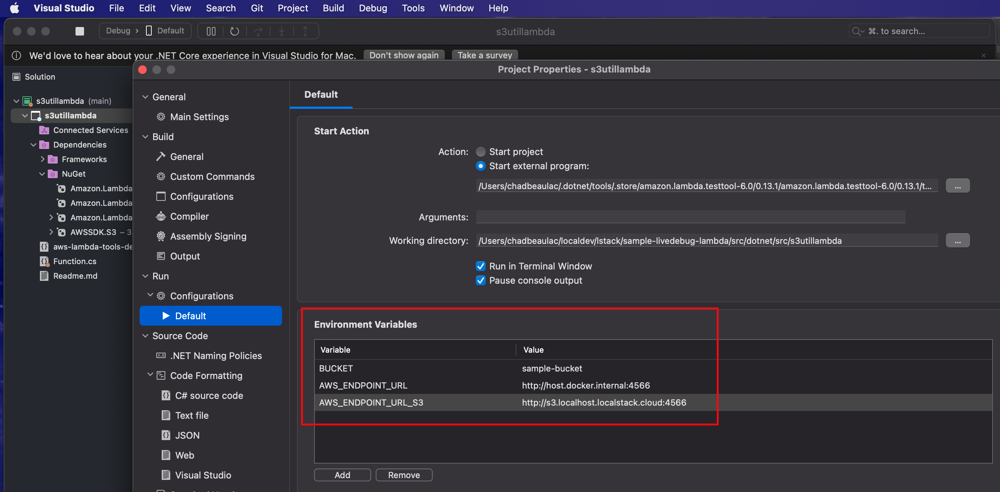

# AWS Lambda Testing on LocalStack and AWS Deploy

This example includes C# dotnet Lambdas, SQS, and DynamoDB. It demonstrates how to deploy
multiple services to LocalStack and AWS. The DynamoDB table acts as a set of unique keys for objects in S3.
The solution could be used as a starting point for a more complex solution that uses S3, DynamoDB, SQS, and Lambdas.
For example, the unique set of keys in DynamoDB could be used by a batch job to process invoices, orders, etc.


## Deploying the App to LocalStack

To deploy your infrastructure, follow the steps below.

### Prerequisites

1. [Install Watchman](https://facebook.github.io/watchman/)
2. [Install LATEST AWS CLI](https://docs.aws.amazon.com/cli/latest/userguide/getting-started-install.html)
3. [Install Terraform](https://developer.hashicorp.com/terraform/tutorials/aws-get-started/install-cli)


4. Install Node Version Manager (NVM)
   https://github.com/nvm-sh/nvm#installing-and-updating

5. Select Node version 18

```shell
nvm install 18
```

6. Install Terraform CDK
   Install cdktf in the node 18 version you just installed in step (4).

```shell
npm install --global cdktf-cli@latest
```

### Steps

After cloning this repo, from this working directory, run these commands:

1. Set your LocalStack pro key

      ```bash
      export LOCALSTACK_API_KEY=<your key>
      ```

2. Start LocalStack

      ```bash
      make start-localstack
      ```


3. Setup an AWS_PROFILE for LocalStack

#### Add this to your `~/.aws/config` file

```text
[profile localstack]
region=us-east-1
output=json
endpoint_url = http://localhost:4566
```

#### Add this to your `~/.aws/credentials` file

```text
[localstack]
aws_access_key_id=test
aws_secret_access_key=test
```

# Deploy to LocalStack with IaC

## Terraform CDK IaC Instructions

### Install pipeline packages

You need to do this initially, and if you manually add packages to `iac/terraform/cdk/package.json`

```shell
make local-cdktf-install
```

### Deploy the Terraform CDK IaC Stack

This will deploy the S3 bucket, Lambda in hot reload mode, all roles and policies.

```shell
make local-cdktf-deploy
```

## Testing Dotnet C# Lambda

There are two ways to hot reload and live test your C# Lambda now.
Using Visual Studio with the Lambda Test Tool, and deploying the Lambda to LocalStack with hot reloading.
We'll cover both now.

### Debugging C# Lambda with Hot-Deploy to LocalStack

We'll deploy the C# Lambda to LocalStack using the CLI.
This is useful for test-driven development where you're testing a Lambda over and over again by running tests that
invoke it. This development method runs the Lambda in a hot-deploy scenario. Changes to the Lambda are immediately
redeployed to
LocalStack.

1. Re-publish the dotnet bundle when code changes

```shell
make watch-dotnet
```

2. Test Invoke

```shell
make local-dotnet-ls-invoke
```

You can run this command to put some data in the S3 bucket so the Lambda actually returns some results.

```shell
make cp-readme
```

#### Testing Scenario for Hot-Reloading

Now that you've deployed everything and you can invoke the Lambda manually using `make local-dotnet-ls-invoke`,
as described in the instructions above, you can get into a fast dev cycle with some integration tests (not included
yet).
Your DevX looks like

1. You're deployed in hot-reload mode from the steps above and watching the Lambda code for changes and rebuilding
2. Write an integration test that invokes the Lambda and asserts outcomes
3. Make changes to the Lambda, run the test
4. Goto step (3)

### Debugging Lambda in Visual Studio with Lambda Test Tool

We'll run the Lambda in Visual Studio with full access to the debugger.
This is useful for deep debugging using the Visual Studio debugger with break points

1. Open the `src/dotnet/src/s3utillambda/s3utillambda.csproj` file in Visual Studio.
   

2. Configure Lambda Test Tool

- [Windows config](https://github.com/aws/aws-lambda-dotnet/blob/master/Tools/LambdaTestTool/README.md#configure-for-visual-studio)
- [Mac config](https://github.com/aws/aws-lambda-dotnet/blob/master/Tools/LambdaTestTool/README.md#configure-for-visual-studio-for-mac)

Opening the properties looks like this on a Mac.


Configure the Lambda test tool per the Lambda Test Tool links in this step.
On a Mac you point the external command to the `Amazon.Lambda.TestTool.BlazorTester.dll` file.
Typically, in a location like

```text
/Users/<someuser>/.dotnet/tools/.store/amazon.lambda.testtool-6.0/0.13.1/amazon.lambda.testtool-6.0/0.13.1/tools/net6.0/any/Amazon.Lambda.TestTool.BlazorTester.dll
```

Also add the two environment variables.


3. Debugging with Lambda Test Tool
   You can set break points in the function. Hit the run button to launch the test tool and invoke the Lambda.
   

This launches the test tool on ["localhost:5050"](http://localhost:5050 "Invoke Lambda") where you can invoke the Lambda
with no parameters.


You can run this command to put some data in the S3 bucket so the Lambda actually returns some results.

```shell
make cp-readme
```

Then the invoke output will look like this


# AWS Deploy Instructions

We use the same IaC pipelines to deploy to AWS! This is a very important point that LocalStack enables teams
to test their IaC pipelines locally before ever deploying them to a live AWS environment.

## Set Live AWS Credentials

However you set your credentials in your terminal, do it now.

## Add Environment Config

This project stores Terraform state in an AWS S3 bucket in the target account.
Create an S3 bucket in your target account to hold the Terraform state

```shell
aws s3 mb s3://<name of your bucket>-<region where bucket is> --region <region where your bucket is>
# enable versioning in case of state corruption
aws s3api put-bucket-versioning --bucket <your full bucket name> --versioning-configuration Status=Enabled
```

Create a file called `nonenv.makefile` at the root of this project.

```makefile
non%: export TERRAFORM_STATE_BUCKET=<your bucket name. ie my-happy-bucket-us-east-1>
non%: export PULUMI_BACKEND_URL=s3://$(TERRAFORM_STATE_BUCKET)
non%: export LIST_BUCKET_NAME=<choose a unique bucket name that your Lambda will get a list of objects from>
```

### Deploy to AWS with Terraform-CDK

```shell
make non-cdktf-deploy
```

### Invoke the Lambda in AWS

```shell
make non-dotnet-invoke
```

See the output.

```shell
cat output.txt
```

### Copy a file to the S3 Bucket the Lambda is listing

```shell
make non-cp-readme
```

Now you can invoke it again and view the new output.

## Destroy the Deployed Stack

Before destroying the stack, empty the bucket the Lambda uses.

```shell
make non-empty-bucket
```

```shell
make non-cdktf-destroy
```

# Deprecated IaC

This HCL IaC isn't being used anymore. The Terraform CDK IaC is up to date.

#### Terraform HCL

[Install Terraform](https://developer.hashicorp.com/terraform/tutorials/aws-get-started/install-cli)

This will deploy S3 resources that the test Lambdas will use. It does not deploy the Lambdas, we'll cover that next.

 ```bash
 make local-tformhcl-deploy
 ```
